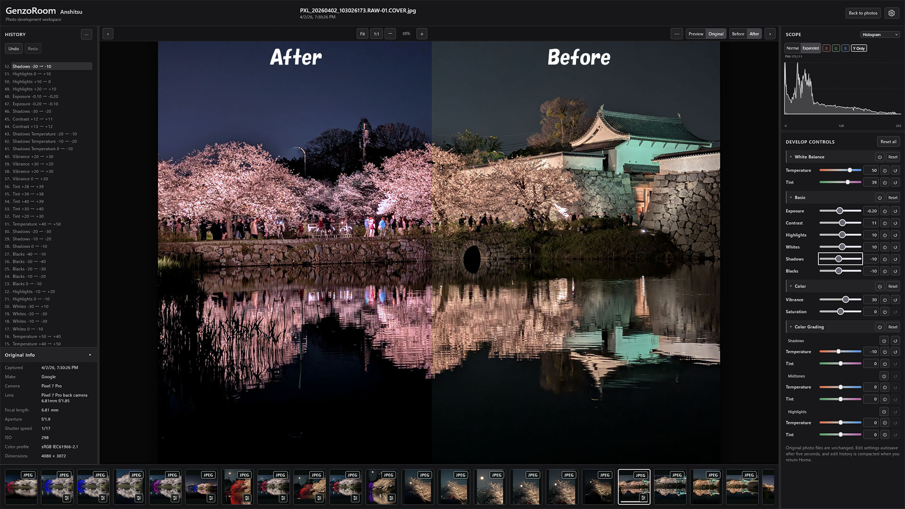
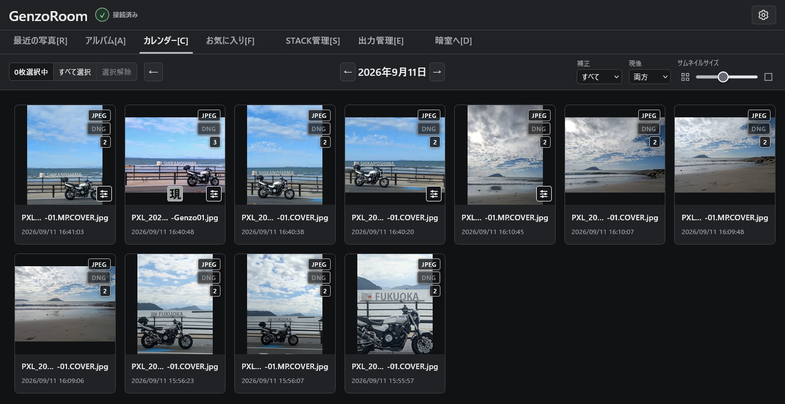
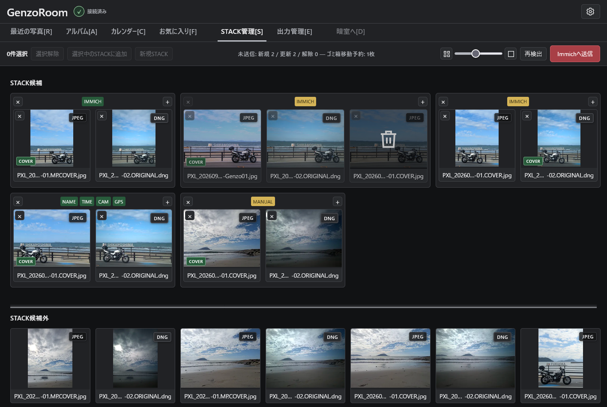

# GenzoRoom

[English](README.md) | 日本語

GenzoRoom（現像室）は、写真管理アプリ Immich と連携する、セルフホスト型の写真現像Webアプリです。

Immichでは扱いが難しいJPEGとRAWのペアを自動検出してスタック化するほか、手動でのスタックの組み換えや代表写真（カバー）の変更にも対応しています。

また、JPEG写真の色や明るさを調整する非破壊現像機能を搭載。現像した写真は元画像を残したままImmichに書き戻し、元画像と自動的にスタック化して、新しい写真をカバーに設定します。  
写真の管理はImmichが担当し、GenzoRoomが写真の原本を直接編集・削除することはありません。  
Immichとの連携に特化しているため、外部からの写真の取り込みや、ローカルへのファイル書き出し機能は搭載していません。

ユーザーインターフェースは日本語と英語に対応しています。その他の言語への翻訳協力も歓迎しています。

現在はJPEG現像のみ対応していますが、将来的にはRAW現像への対応も予定しています。

  
*デスクトップ版Anshitsuワークスペースで編集したJPEGの現像前後の比較。*

## 現在の機能

### 〇 写真の閲覧と選択 〇

ギャラリーでは「最近の写真」「アルバム」「カレンダー」「お気に入り」の各タブから写真を閲覧・選択できます。選んだ写真はSTACK管理や暗室（現像）で使用でき、現像済みの写真は出力管理からImmichへ書き戻せます。  

写真の一覧には、JPEG・RAWなどのファイル形式やスタック内の写真枚数がバッジで表示されます。また、写真の絞り込み、サムネイルサイズの変更、複数の写真の選択にも対応しています。

  
*写真の形式やスタック情報を確認できるギャラリー画面。*

### 〇 STACK管理 〇

RAW+JPEGのペアなどを自動検出してSTACK候補を作成できるほか、手動での組み換えやカバー写真の変更にも対応しています。

自動検出では、ファイル名の最初のドットより前の部分が一致する写真をSTACK候補とします。  
名前が一致しない場合も、撮影日時・カメラ情報・GPS情報（利用可能な場合）を照合して判定します。  
判定の根拠はSTACK上部の「NAME」「TIME」「CAM」「GPS」のバッジで確認できます。

不要な写真はImmichのゴミ箱へ移動予約し、確認後にまとめて送信できます。  

GenzoRoomが元素材ファイルを直接変更・削除することはありません。

  
*既存STACKの確認、自動候補の検出、手動での組み換え、カバー変更、不要写真のゴミ箱予約に対応したSTACK管理画面。*

### 〇 暗室(現像ワークスペース) 〇

ギャラリーで選択した写真を暗室へ送り、明るさや色合いを調整できます。  
現在はJPEGの現像に対応しており、将来的にはRAW現像への対応も予定しています。

暗室はキーボードショートカットを活用し、マウス操作をできるだけ減らして作業できるよう設計しています。  
複数の写真を送った場合も、フィルムストリップで写真を切り替えながら編集できます。

#### 主な機能

- 高速プレビュー：  
WebGPUによる高速描画に対応。フル解像度とImmichプレビュー画像を切り替えて編集できます。
- 画像比較：  
プレビュー画像とフル解像度のオリジナル画像を切り替えられるほか、編集前後の比較表示にも対応しています。
- 編集レシピのコピー・貼り付け：  
調整した明るさや色などの設定を別の写真にコピーできます。  
すべての調整値をまとめてコピーするほか、必要な項目だけを選んでコピー・貼り付けすることもできます。
- 編集履歴：  
HistoryによるUndo / Redoに対応。不要な中間履歴を整理する圧縮機能も搭載しています。
- 出力予約：  
編集した写真を暗室から出力キューへ追加し、出力管理へ引き渡せます。

編集内容と履歴は自動保存され、元のJPEGを変更することなく、後から再編集できます。

#### WebGPUによる高速化について

WebGPUに対応したGPU・ドライバー・ブラウザーを使用することで、編集結果を高速に表示できます。  
対応環境ではフル解像度のオリジナル画像を使ったリアルタイム編集も可能です。

WebGPUを利用するには、以下の条件が必要です。

- WebGPUに対応したGPU・ドライバー・ブラウザー
- HTTPSまたはlocalhostなど、ブラウザーが認めるセキュアコンテキストでの接続
- GenzoRoomの設定でWebGPUを有効化

通常のHTTPによるLAN内アクセスでは、原則としてWebGPUを利用できません。  
ただし、ブラウザーの開発者向け設定で接続先をセキュアコンテキストの例外に登録することで、WebGPUを利用できる場合があります。

WebGPUが利用できない場合もCPUによる編集が可能です。  
処理が重い場合は、Immichが生成したプレビュー画像に切り替えることで負荷を軽減できます。

#### 現在の調整項目

| カテゴリ | 調整項目 |
| --- | --- |
| ホワイトバランス | 色温度(JPEG画像では相対値)、色かぶり補正(TINT)|
| 基本補正 | 露光量、コントラスト、ハイライト、ホワイト、シャドウ、ブラック |
| 色補正 | 自然な彩度、彩度 |
| カラーグレーディング | シャドウ・中間調・ハイライトそれぞれの色温度と色かぶり補正 |


### 〇 出力管理 〇

- Homeタブまたは`E`でExport / 出力管理を開きます。Galleryのビュー状態を保ったまま、同じHeader / Tabs / Toolbar / Contentシェルを使用します。
- 永続化されたExport Queueは、個別の写真カードとして表示されます。同じImmich Stackに属するQueueアセットが2つ以上ある場合はグループ化され、Queueに入っているメンバーだけが表示されます。グループは最初のQueueメンバーから始まり、メンバー順を維持します。メンバーが1つだけになると単独カードになります。サムネイルサイズはHomeと共通です。
- Exportカードには現在、Queueアセットを識別するためにImmichのソースサムネイルが表示されます。GenzoRoomのRecipeで描画したプレビューではありません。
- 通常クリック、Primary+クリック、Shift+クリック、チェックボックス、Select All / `Primary+A`でカードを選択します。Shift範囲は表示されたグループ順に沿います。ClearとEscapeで選択を解除します。
- `W`を押すと、選択された変更可能なカードを明示的にExport待機状態にします。状態が混在する選択では待機をONにし、すべて待機中の場合はOFFにします。選択解除やHomeタブの切り替え後も待機状態を維持しますが、一時的な状態であり、再読み込み後には保存されません。永続的なQueueメンバーシップやRuntime状態`waiting`とは別の状態です。
- 待機中のカードでは、サムネイル下端に幅いっぱいで高さ28pxのステータスバーを重ねて**Ready to export / 出力待機中**と表示します。
- 失敗したExportの再試行中は、失敗したカードだけを操作できます。他のQueueカードは内部の待機状態を保持しますが、待機バッジは一時的に非表示となり、選択と削除が無効になります。この制限はタブバーに表示されます。失敗項目のない状態でRetryが終わると、通常の操作に戻ります。
- `Q`またはRemove from Queueでは、選択された`queued` / `failed`アセットを順次削除します。削除に成功したアセットはすぐに消えます。失敗した場合も成功済みの処理は保持し、ローカライズされたアラートとともに一覧を更新します。`waiting`、`encoding`、`registering`のカードは選択、待機状態変更、削除がロックされます。GalleryとAnshitsuでは、各画面固有のQueue切り替え動作を維持します。
- Exportで`Primary+Z`（Ctrl+Z / ⌘Z）を押すと、直近のWによる待機状態変更またはQによる削除を1回Undoできます。選択は復元されず、Redoもありません。
- **Export to Immich / Immichへ出力**で確認すると、待機中の`queued`アセットをQueue順に、保存済みRecipeを使用して開始します。出力はフル解像度JPEGで、ファイル名は系列に基づく`GenzoNN`形式です。GenzoRoomタグを付け、元StackのCoverに設定します。Exportのキャンセルを確認すると、現在の写真の処理後に停止します。失敗項目がある場合、**Retry export / 出力を再試行**で確認すると、それらの項目だけを最新の保存済みRecipeで開始します。開始、キャンセル、Retry、成功したExportはW/Q Undoの対象外です。
- Backend再起動後は、中断された処理が再開します。登録が途中で止まるとアップロード済みアセットが残ることがあり、まれに出力が重複する可能性があります。

### 任意のWebGPU高速化

AnshitsuではWebGPUを使い、JPEGプレビューと選択中のオリジナルに対する調整を高速化できます。WebGPUのON/OFFスイッチはSettingsにあり、設定はブラウザーに記憶されます。Settingsでは保存済みの設定と実際の処理状態を区別して表示します。互換性のあるGPU、ドライバー、ブラウザーが必要です。WebGPUには通常Secure Contextが必要です。一般的な利用ではHTTPSを推奨します。WebGPUを利用できない場合、またはGPUの初期化/描画に失敗した場合、AnshitsuはCPU Workerを使います。Workerも失敗した場合は既存のメインスレッド処理へフォールバックします。WebGPUがなくても編集できます。

Windows上のFirefoxとEdge、およびRadeon RX 580の組み合わせで動作を確認しています。RX 580は最低要件ではありません。HTTPで提供されるLANアドレスでは、ブラウザー固有の開発用例外でオリジンをセキュアとして扱う場合に限り、WebGPUを使えるブラウザーがあります。この例外で接続が暗号化されることはなく、HTTP通信は暗号化されません。一般的な利用ではHTTPSを推奨します。ブラウザーごとの詳細な例外設定手順は、このガイドの対象外です。

Copy / Pasteでは、無効なカテゴリ、調整項目、Color Grading範囲の値も含め、保存済みの数値をコピーします。ON/OFFスイッチはコピーされません。貼り付けではコピーした調整値だけを変更し、貼り付け先写真の有効フラグを維持します。カテゴリ、個別調整、Color Grading範囲のコンテキストメニューには、それぞれ該当するコピー、貼り付け、リセット、切り替え操作があります。選択したPasteでは、クリップボードを変えずに任意の一部を適用できます。変更があった貼り付けは、コピー元のファイル名をラベルとする1件のUndo可能なHistoryとして表示されます。既にある値を再度貼り付けても新しい項目は作成されません。テキスト/数値入力欄ではブラウザー標準のCopy / Paste動作を維持します。

## 現在の制限事項

- 作業用画像とHistogramのパイプラインは、引き続きブラウザー管理の8-bit sRGBです。オリジナルのデコード時に埋め込みsRGBおよびDisplay P3プロファイルを考慮し、この作業色空間に変換します。広色域またはHDRのパイプラインではありません。
- HEIC、PNG、RAWなど、JPEG以外のアセットは編集できません。
- DNGを含むRAW現像は未実装です。STACK管理ではJPEGとRAWの撮影データをグループ化できますが、編集できるのはJPEGのみです。JPEGの`COVER.jpg`はJPEGオリジナル経路で処理します。
- オリジナルの描画ではフル解像度のピクセルを処理します。対応環境ではWebGPUで高速化できます。CPU処理も引き続き利用できますが、検証済みのNAS / Firefox環境では低速です。詳細な性能ベンチマークは実施していません。
- 5秒のデバウンス中または保存処理中に行った編集は、再読み込みやタブ終了で失われる可能性があります。これらのブラウザーイベントは捕捉されません。
- Recentには選択した50～500件の範囲が表示されます。現在、ページネーションと検索はありません。
- Anshitsuはデスクトップを優先しており、モバイル専用の編集ワークスペースはありません。
- STACK管理はデスクトップブラウザーで利用できます。タッチ操作のDrag & DropとStack/グループの並べ替えには対応していません。

## 未実装

- RAW現像パイプライン。
- GenzoRoom Export以外で再インポートされたアセットをImmich Stackへ自動的に追加する機能。
- Drag & DropによるStack/グループの並べ替え。
- STACK管理でのタッチ操作によるDrag & Drop。
- Color GradingのPoint / Widthコントロール。現在、3つのトーン範囲には固定ウェイトを使用します。
- Waveform Monitor (WFM)、RGB Parade、Vectorscope。HistogramはScope領域に実装されています。
- マスキングまたは部分調整。
- Cropまたは回転ツール。
- AI支援による調整。
- ノイズ除去。

これらは現在の対応範囲を示すものであり、リリースの約束や確定したロードマップではありません。

## セキュリティとデータの取り扱い

- 通常の写真アクセスにはImmichの読み取りエンドポイントを使用します。専用APIキーには`user.read`、`asset.read`、`asset.view`、`asset.download`、`album.read`、`tag.read`、`asset.upload`、`tag.create`、`tag.asset`、`asset.delete`、`stack.read`、`stack.create`、`stack.update`、`stack.delete`が必要です。これらはHome閲覧、JPEGオリジナル取得、Exportのアップロード/タグ付け、タグ修復、確認後のStack書き込み、確認後のImmichゴミ箱への移動（`force: false`）をカバーします。STACK管理はアセットを完全削除せず、画像オリジナルも変更しません。`server.about`は任意で、Settingsおよび診断出力にImmichのバージョン/ビルド情報を表示するために使います。
- Immich APIキーは環境変数を通じてバックエンドに渡します。フロントエンドへ送られることも、フロントエンドイメージに埋め込まれることもありません。
- ブラウザーからのリクエストには同一オリジンの`/api/`ルートを使います。提供するCompose設定では、バックエンドのポートをホストに公開しません。
- HTTPSのImmich URLでは、TLS証明書の検証を引き続き有効にします。上流のレスポンス本文、認証情報、内部例外の詳細はブラウザーに公開しません。
- 提供するコンテナは非rootユーザーで動作し、Linux capabilitiesを削除して権限昇格を無効にします。
- GenzoRoomは画像オリジナルを変更しません。SQLiteの編集状態APIが保存するのはGenzoRoomのRecipeとHistoryのみです。Stackメンバーシップの書き込みは、明示的に確認されたSTACK管理操作に限定されます。

実際のAPIキーをコミットしたり、コンテナイメージに埋め込んだりしないでください。設定とネットワークの選択肢については[導入ガイド](docs/deployment.md)を参照してください。

## 必要条件

- Docker Compose v2を備えたDocker Engine、またはDocker Standalone環境に接続したPortainer。
- 現在GHCR配布イメージで動作確認済みのLinux `amd64` Dockerホスト。Arm64はサポート対象として案内していません。
- GenzoRoomのバックエンドコンテナから接続できる既存のImmichサーバー。
- 「[セキュリティとデータの取り扱い](#セキュリティとデータの取り扱い)」に記載した権限を持つ専用Immich APIキー。`server.about`は任意です。
- GenzoRoomフロントエンドに接続できるブラウザー。ホストポートの初期値は`3190`で、`GENZOROOM_PORT`で変更できます。

正式版GHCRイメージには固定の`vMAJOR.MINOR.PATCH`タグを使用し、`latest`は最新の正式版を指します。変更可能な`alpha`タグは検証ビルド用であり、正式版ではありません。配布Composeでは公開済みイメージタグの明示が必要で、`latest`を暗黙に選択しません。正式なGitタグをPushすると、イメージ検査の成功後、そのバージョンの確定済みCHANGELOG節から公開GitHub Releaseを作成します。[導入ガイド](docs/deployment.md)と[リリース検証ノート](docs/release-validation.md)を参照してください。

## クイックスタート

GenzoRoomは単一のGHCRイメージとして配布されます。通常の利用者はソースコードのチェックアウト、Node.js、Pythonを用意する必要はありません。配布版が対応するのはLinux `amd64`です。リポジトリのReleasesまたはパッケージページで公開済みと表示されているタグだけを使用してください。

1. 上記に記載した必要権限を持つ専用Immich APIキーを作成します。`server.about`は任意です。
2. このリポジトリから[`compose.release.yml`](compose.release.yml)と[`.env.example`](.env.example)をダウンロードします。`GENZOROOM_IMAGE_TAG`には公開済みの固定バージョンタグを、`GENZOROOM_PERSIST_ROOT`には事前に作成したホスト側の親ディレクトリを設定します。`IMMICH_URL` / `IMMICH_API_KEY`も設定します。UID/GID `10001:10001`に、その親ディレクトリへの書き込み/通過権限を付与してください。SQLiteはそのディレクトリ配下の`data/genzoroom.db`に保持されます。LAN/HTTPS接続と同一ホスト上のImmichへの接続方法は[導入ガイド](docs/deployment.md)を参照してください。
3. Docker Composeで設定を検証し、公開済みイメージを起動します。

   ```sh
   docker compose -f compose.release.yml config --quiet
   docker compose -f compose.release.yml pull
   docker compose -f compose.release.yml up -d
   ```

   Portainerでは**Web editor**を使い、`compose.release.yml`全体を貼り付けて、Stackの環境設定に同じ変数を設定します。同一Dockerホスト上のImmichを使う場合は、導入ガイドに記載された単独Composeの例を使用してください。
4. 設定したアドレスを開きます。利用できる場合はHTTPSを使用してください。ホストポートの初期値は`3190`です。通常のHTTPでは接続は暗号化されません。

## アーキテクチャとドキュメント

- [アーキテクチャ](docs/architecture.md) — リクエストの流れ、コンテナ境界、編集モデル、現在の技術的な制限事項。
- [導入](docs/deployment.md) — Docker Compose、Portainer、Immichへのネットワーク経路、検証、トラブルシューティング、削除。
- [開発ノート（日本語）](docs/development-notes.ja.md) — 実装履歴と設計上の判断。
- [導入ノート（日本語）](docs/deployment-notes.ja.md) — 現在検証済みの導入方法に関するメモ。確認されたQNAPのネットワーク問題を1件含みます。

## 開発について

GenzoRoomは、ChatGPTとOpenAI Codexを活用して開発しているオープンソースプロジェクトです。  
機能の企画・仕様策定・設計方針の決定は開発者が主導し、ChatGPTとの対話を通じて仕様を具体化しています。コードの実装、テストの作成・実行、コード監査にはCodexを活用しています。  
完成した機能は自動テストに加えて実際の環境で動作を確認し、問題点の修正や改善を重ねています。

## ライセンス

GenzoRoomは[GNU Affero General Public License v3.0](LICENSE)（`AGPL-3.0-only`）のもとでライセンスされています。
