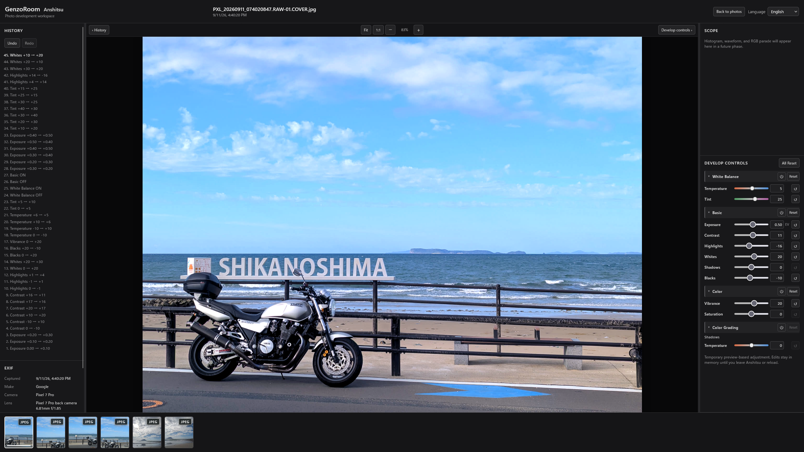

# GenzoRoom

GenzoRoom is an early-development, self-hosted browser interface for developing and color-correcting photos managed by [Immich](https://immich.app/). It connects to Immich through a read-only backend and currently applies non-destructive adjustments locally to Immich-generated JPEG previews.

This is not yet a RAW development pipeline. RAW files can be browsed and filtered, but RAW processing itself is not implemented. The name comes from the Japanese word **現像 (genzō)**, meaning photographic development.



*The current desktop-focused Anshitsu workspace.*

## Current features

### Immich browsing and Anshitsu

- Authenticated, read-only Immich connectivity.
- Up to 100 recent photos with proxied thumbnails and format badges.
- Client-side RAW / Non-RAW filtering.
- Ordered multi-photo selection into the **Anshitsu** development workspace.
- Active-photo switching through the Filmstrip, with EXIF details for the current photo.
- Per-photo JPEG edit recipes and History restored from SQLite when a photo is opened and saved before a dirty Filmstrip switch.
- Dirty JPEG edits are autosaved after five seconds without an editing change; Filmstrip switches still save immediately.
- Returning Home from Anshitsu saves every photo edited during that Anshitsu session and compacts its History.
- Undo / Redo, individual adjustment Reset, category Reset, and All Reset.
- History header and row menus for compaction, clearing History, choosing a new starting point, and resetting edits. Clear and reset require a No-first confirmation; compaction, clear, and partial deletion support immediate organization Undo.
- Copy and paste adjustment values between photos: `Ctrl+C` copies the current slider operation target, or all values when the Viewer is the target; `Ctrl+V` applies the copied values to the active photo without requiring slider or Viewer focus. `Ctrl+Alt+C` and `Ctrl+Alt+V` open item-selection dialogs, and the Viewer’s `⋯` menu offers all four actions.
- Copy / Paste uses one tab-local GenzoRoom clipboard for all 16 numeric adjustments. Enabled flags are never copied, the clipboard survives navigation Home and back within the tab, and it is cleared by a page reload or tab close. OS clipboard contents are not used.
- Web Worker preview rendering with only the latest pending edit retained, plus a main-thread fallback if the Worker is unavailable or fails.
- Fit, 1:1, zoom, and pan controls.
- Before / After display toggle and hold the Backslash key for temporary Before; comparison bypasses develop adjustments without changing edits or zoom/pan.
- Independently collapsible and resizable desktop sidebars with remembered widths.
- English and Japanese UI with remembered language selection and locale-aware dates.

Anshitsu loads saved JPEG edit state before enabling Develop controls. Dirty edits are autosaved with their full History after five seconds of inactivity, and a dirty photo is saved before a Filmstrip switch. The **Back to photos** control performs a final sequential save for every photo edited in that Anshitsu session and compacts each History. If a save response is lost, GenzoRoom retries that exact snapshot, revision, and save ID before sending a newer snapshot; genuine revision conflicts are reported without merging. Reloading or closing the browser during the debounce or an in-flight save can still lose the latest edits; Browser Back and tab-close interception are not implemented. A failed final save offers the choice to stay in Anshitsu or exit without saving.

### Current adjustments

Editing is currently available for JPEG assets only and uses the Immich-generated JPEG preview as its source.

| Category | Adjustments |
| --- | --- |
| White Balance | Temperature, Tint |
| Basic | Exposure, Contrast, Highlights, Whites, Shadows, Blacks |
| Color | Vibrance, Saturation |
| Color Grading | Shadows Temperature, Shadows Tint, Midtones Temperature, Midtones Tint, Highlights Temperature, Highlights Tint |

Each category can be collapsed, temporarily bypassed without losing its values, and reset independently. Shadows, Midtones, and Highlights also have separate ON/OFF switches within Color Grading; switching one off preserves its Temperature and Tint values. Adjustment changes and ON/OFF operations participate in History and Undo / Redo. Processing is performed locally in the browser; Immich originals are not modified.

Copy / Paste transfers saved numeric values, including values in disabled categories or Color Grading ranges. Paste changes only the copied adjustment values and keeps the destination photo’s seven enabled flags. A selected Paste can apply any subset without changing the clipboard. Each changed Paste appears as one undoable History entry labelled with the source filename; repeating values already present creates no new entry. Text and numeric editing fields keep their native browser Copy / Paste behavior.

## Current limitations

- Adjustments operate on Immich-generated JPEG previews, not original files or an original-quality rendering path.
- HEIC, PNG, RAW, and other non-JPEG assets are not editable.
- The preview pipeline is browser-managed 8-bit sRGB; wide-gamut, HDR, color-profile matching, and large-image performance need further work.
- Edits made within the five-second debounce or during an in-flight save can be lost on reload or tab close; these browser events are not intercepted.
- Recent Photos is limited to 100 items and currently has no pagination or search.
- Anshitsu is desktop-first; there is no dedicated mobile editing workspace.
- Immich asset Stack handling is not implemented.

## Not implemented

- RAW development pipeline.
- Color Grading Point / Width controls; the three tone ranges currently use fixed weights.
- Export or write-back to Immich.
- Scopes such as Histogram, Waveform, and RGB Parade; the current Scope area is a placeholder.
- Masking or local adjustments.
- Crop or rotate tools.
- AI-assisted adjustments.
- Noise reduction.

These are current boundaries, not release commitments or a promised roadmap.

## Security and data handling

- GenzoRoom currently calls read-only Immich endpoints. Use a dedicated API key with only `user.read`, `asset.read`, and `asset.view` permissions.
- The Immich API key is supplied to the backend through environment variables. It is not sent to the frontend or embedded in the frontend image.
- Browser requests use same-origin `/api/` routes. The backend port is not published to the host in the provided Compose configuration.
- TLS certificate verification remains enabled for HTTPS Immich URLs. Upstream response bodies, credentials, and internal exception details are not exposed to the browser.
- The provided containers run as non-root users, drop Linux capabilities, and disable privilege escalation.
- GenzoRoom does not modify originals or call Immich write endpoints. Its SQLite edit-state API stores only GenzoRoom recipes and History.

Never commit a real API key or bake one into a container image. See the [deployment guide](docs/deployment.md) for configuration and network options.

## Requirements

- Docker Engine with Docker Compose v2, or Portainer connected to a Docker Standalone environment.
- An existing Immich server reachable from the GenzoRoom backend container.
- A dedicated Immich API key with `user.read`, `asset.read`, and `asset.view` permissions.
- A browser that can reach the GenzoRoom frontend. The default host port is `3190` and can be changed with `GENZOROOM_PORT`.

## Quick start

1. Create a dedicated Immich API key with the minimum permissions listed above.
2. For Docker Compose, copy [`.env.example`](.env.example) to `.env` and configure `IMMICH_URL` and `IMMICH_API_KEY`. Set `GENZOROOM_PERSIST_ROOT` or `GENZOROOM_DATA_PATH`, then prepare the resulting host data directory and grant UID/GID `10001:10001` write access as described in the [deployment guide](docs/deployment.md). Portainer users can set the same values as Stack environment variables. Optionally set `GENZOROOM_PORT`; it defaults to `3190`.
3. From a repository checkout, build and start the standard Docker Compose deployment:

   ```sh
   docker compose up -d --build
   ```

4. Open `http://<HOST-IP>:3190`, or the configured port.

If Immich runs on the same Docker host and is not reachable through the host LAN address, use the optional shared-network configuration documented in the [deployment guide](docs/deployment.md). Portainer Git Repository Stack instructions are covered there as well.

## Architecture and documentation

- [Architecture](docs/architecture.md) — request flow, container boundaries, editing model, and current technical limitations.
- [Deployment](docs/deployment.md) — Docker Compose, Portainer, Immich network routes, verification, troubleshooting, and removal.
- [Development notes (Japanese)](docs/development-notes.ja.md) — implementation history and design decisions.
- [Deployment notes (Japanese)](docs/deployment-notes.ja.md) — notes for the currently validated deployment, including one observed QNAP networking issue.

## License

GenzoRoom is licensed under the [GNU Affero General Public License v3.0](LICENSE) (`AGPL-3.0-only`).
