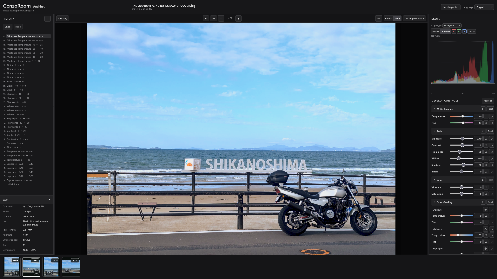

# GenzoRoom

GenzoRoom is an early-development, self-hosted browser interface for developing and color-correcting photos managed by [Immich](https://immich.app/). It connects to Immich through a read-only backend and applies non-destructive adjustments locally to JPEG previews or, in Anshitsu, the selected JPEG original.

This is not yet a RAW development pipeline. RAW files can be browsed and filtered, but RAW processing itself is not implemented. The name comes from the Japanese word **現像 (genzō)**, meaning photographic development.



*The desktop Anshitsu workspace with the Histogram Scope in the upper-right panel.*

## Current features

### Immich browsing and Anshitsu

- Authenticated, read-only Immich connectivity.
- Up to 100 recent photos with proxied thumbnails and format badges.
- Client-side RAW / Non-RAW filtering.
- Ordered multi-photo selection into the **Anshitsu** development workspace.
- Active-photo switching through the Filmstrip, with EXIF details for the current photo.
- Home and Filmstrip continue to use Immich thumbnails. Anshitsu starts with the Immich preview and acquires only the selected JPEG original in the background; JPEG-only captures and Pixel `RAW-01.COVER.jpg` use the same path. The original is reused while that photo remains selected and released when leaving it. Acquisition or decode failure leaves preview editing available. Immich API credentials stay in the backend.
- Switch between Preview and Original beside Before / After. Both display modes share the same Recipe, History, Undo / Redo, and adjustment ON/OFF state; the display choice is temporary and is not saved. The original is also available to Before / After, Fit, 1:1, and Histogram. Original Info shows its embedded color-profile description and image dimensions, including while Preview is displayed.
- Viewer shortcuts: `]` toggles Preview / Original, and holding Backslash temporarily displays Before. On JIS keyboards, `]` takes priority when the event code is `Backslash`; while the original is loading or unavailable this key does not invoke the Backslash action. Existing text-input, IME, dialog, and menu guards remain active.
- The Viewer toolbar places Preview / Original before Before / After. The left History and right Develop panel buttons use state-aware arrow icons with Japanese and English tooltips.
- Per-photo JPEG edit recipes and History restored from SQLite when a photo is opened and saved before a dirty Filmstrip switch.
- Dirty JPEG edits are autosaved after five seconds without an editing change; Filmstrip switches still save immediately.
- Returning Home from Anshitsu saves every photo edited during that Anshitsu session and compacts its History.
- The Home grid and Filmstrip show an edited marker for photos with saved edits; Home supports Shift+click range selection in the visible photo order.
- The shared GenzoRoom title returns from Anshitsu to Home through the existing save-and-exit flow; Home's title remains on Home.
- Undo / Redo, individual adjustment Reset, category Reset, and All Reset.
- History rows can jump directly to an edit state. Header and right-click row menus provide History compaction, clearing, partial deletion from the clicked row, and edit initialization. Compaction, clear, and partial deletion can be immediately undone; clear and reset use localized Cancel / Continue confirmations, with an irreversible-action warning for reset only.
- Copy and paste adjustment values between photos: `Ctrl+C` copies the current slider operation target, or all values when the Viewer is the target; `Ctrl+V` applies the copied values to the active photo without requiring slider or Viewer focus. `Ctrl+Alt+C` and `Ctrl+Alt+V` open item-selection dialogs, and the Viewer’s `⋯` menu offers all four actions.
- Copy / Paste uses one tab-local GenzoRoom clipboard for all 16 numeric adjustments. Enabled flags are never copied, the clipboard survives navigation Home and back within the tab, and it is cleared by a page reload or tab close. OS clipboard contents are not used.
- Web Worker and optional WebGPU rendering for JPEG previews and selected originals, with only the latest pending edit retained and a main-thread fallback if the Worker is unavailable or fails.
- Fit, 1:1, zoom, and pan controls.
- Before / After display toggle and hold the Backslash key for temporary Before; comparison bypasses develop adjustments without changing edits or zoom/pan.
- An 8-bit sRGB Histogram from JPEG previews and selected originals, with 256 bins each for R, G, B, and Y′. The Scope supports individual RGB visibility while keeping at least one channel on, Y Only, a Normal scale based on the shared RGB maximum, and an Expanded scale using nearest-rank P99. It follows both persistent and temporary Viewer Before / After display. On desktop, its height can be resized from 15% to 40% of the right panel (30% by default) and is remembered by the browser.
- Histogram shortcuts: Numpad 0 toggles Y Only; Numpad 1, 2, and 3 toggle R, G, and B; Numpad Decimal toggles Normal / Expanded. While Y Only is active, the first Numpad 1–3 press restores the previous RGB selection; the next press toggles that channel. Text and number fields keep native keypad input.
- RGB visibility, Y Only, and scale mode remain selected when switching photos in Anshitsu.
- Independently collapsible and resizable desktop sidebars with remembered widths.
- English and Japanese UI with remembered language selection and locale-aware dates.

Anshitsu loads saved JPEG edit state before enabling Develop controls. Dirty edits are autosaved with their full History after five seconds of inactivity, and a dirty photo is saved before a Filmstrip switch. The **Back to photos** control performs a final sequential save for every photo edited in that Anshitsu session and compacts each History. If a save response is lost, GenzoRoom retries that exact snapshot, revision, and save ID before sending a newer snapshot; genuine revision conflicts are reported without merging. Reloading or closing the browser during the debounce or an in-flight save can still lose the latest edits; Browser Back and tab-close interception are not implemented. A failed final save offers the choice to stay in Anshitsu or exit without saving.

### Current adjustments

Editing is currently available for JPEG assets only. Anshitsu begins with the Immich-generated JPEG preview and can use the selected JPEG original as its image source.

| Category | Adjustments |
| --- | --- |
| White Balance | Temperature, Tint |
| Basic | Exposure, Contrast, Highlights, Whites, Shadows, Blacks |
| Color | Vibrance, Saturation |
| Color Grading | Shadows Temperature, Shadows Tint, Midtones Temperature, Midtones Tint, Highlights Temperature, Highlights Tint |

Recipe v18 provides an individual ON/OFF switch for each of the 16 numeric adjustments, in addition to independent category and Color Grading range switches. These 23 switches do not enable or disable one another, and turning any switch off retains its numeric values. Individual, category, range, and all-reset operations participate in History and Undo / Redo. Processing is performed locally in the browser; Immich originals are not modified.

### Optional WebGPU acceleration

Anshitsu can use WebGPU to accelerate JPEG preview and selected-original adjustments. The WebGPU ON/OFF switch is beside the language selector, and its preference is remembered by the browser. A compatible GPU, driver, and browser are required; WebGPU generally requires a Secure Context, normally HTTPS or `localhost`. If WebGPU is unavailable or GPU initialization or rendering fails, Anshitsu uses the CPU Worker, with the existing main-thread fallback if the Worker also fails. Editing remains available without WebGPU.

Firefox and Edge on Windows with a Radeon RX 580 are a verified configuration; the RX 580 is not a minimum requirement. On a LAN address served over HTTP, using WebGPU requires a browser-specific development exception that treats the origin as secure. This exception does not encrypt the connection. Prefer HTTPS or `localhost` where possible. Detailed instructions for browser exceptions belong in a future installation guide.

Copy / Paste transfers saved numeric values, including values in disabled categories, adjustments, or Color Grading ranges; ON/OFF switches are never copied. Paste changes only the copied adjustment values and keeps the destination photo’s enabled flags. Category, individual adjustment, and Color Grading range context menus provide their relevant copy, paste, reset, or toggle operations. A selected Paste can apply any subset without changing the clipboard. Each changed Paste appears as one undoable History entry labelled with the source filename; repeating values already present creates no new entry. Text and numeric editing fields keep their native browser Copy / Paste behavior.

## Current limitations

- The working and Histogram pipeline remains browser-managed 8-bit sRGB. Embedded sRGB and Display P3 profiles are considered during original decoding and converted into that working space; this is not a wide-gamut or HDR pipeline.
- HEIC, PNG, RAW, and other non-JPEG assets are not editable.
- RAW development, including DNG, remains unimplemented. A JPEG `COVER.jpg` is handled as a JPEG original; GenzoRoom does not pair or manage it with a RAW asset.
- Original rendering processes full-resolution pixels. WebGPU can accelerate this path when supported; CPU processing remains available and is slower on the tested NAS / Firefox setup. No detailed performance benchmark has been performed.
- Edits made within the five-second debounce or during an in-flight save can be lost on reload or tab close; these browser events are not intercepted.
- Recent Photos is limited to 100 items and currently has no pagination or search.
- Anshitsu is desktop-first; there is no dedicated mobile editing workspace.
- Immich asset Stack handling is not implemented.

## Not implemented

- RAW development pipeline.
- Color Grading Point / Width controls; the three tone ranges currently use fixed weights.
- Export or write-back to Immich.
- Waveform Monitor (WFM), RGB Parade, and Vectorscope. Histogram is implemented in the Scope area.
- Masking or local adjustments.
- Crop or rotate tools.
- AI-assisted adjustments.
- Noise reduction.

These are current boundaries, not release commitments or a promised roadmap.

## Security and data handling

- GenzoRoom calls read-only Immich endpoints. Use a dedicated API key with `user.read`, `asset.read`, `asset.view`, and `asset.download` permissions; `asset.download` is required to retrieve JPEG originals.
- The Immich API key is supplied to the backend through environment variables. It is not sent to the frontend or embedded in the frontend image.
- Browser requests use same-origin `/api/` routes. The backend port is not published to the host in the provided Compose configuration.
- TLS certificate verification remains enabled for HTTPS Immich URLs. Upstream response bodies, credentials, and internal exception details are not exposed to the browser.
- The provided containers run as non-root users, drop Linux capabilities, and disable privilege escalation.
- GenzoRoom does not modify originals or call Immich write endpoints. Its SQLite edit-state API stores only GenzoRoom recipes and History.

Never commit a real API key or bake one into a container image. See the [deployment guide](docs/deployment.md) for configuration and network options.

## Requirements

- Docker Engine with Docker Compose v2, or Portainer connected to a Docker Standalone environment.
- An existing Immich server reachable from the GenzoRoom backend container.
- A dedicated Immich API key with `user.read`, `asset.read`, `asset.view`, and `asset.download` permissions.
- A browser that can reach the GenzoRoom frontend. The default host port is `3190` and can be changed with `GENZOROOM_PORT`.

## Quick start

1. Create a dedicated Immich API key with the permissions listed above.
2. For Docker Compose, copy [`.env.example`](.env.example) to `.env` and configure `IMMICH_URL` and `IMMICH_API_KEY`. Set `GENZOROOM_PERSIST_ROOT` or `GENZOROOM_DATA_PATH`, then prepare the resulting host data directory and grant UID/GID `10001:10001` write access as described in the [deployment guide](docs/deployment.md). Portainer users can set the same values as Stack environment variables. Optionally set `GENZOROOM_PORT`; it defaults to `3190`.
3. From a repository checkout, build and start the standard Docker Compose deployment:

   ```sh
   docker compose up -d --build
   ```

4. Open `http://<HOST-IP>:3190`, or the configured port.

If Immich runs on the same Docker host and is not reachable through the host LAN address, use the optional shared-network configuration documented in the [deployment guide](docs/deployment.md). Portainer Git Repository Stack instructions are covered there as well.

## Architecture and documentation

- [Architecture](docs/architecture.md) — request flow, container boundaries, editing model, and current technical limitations.
- [Deployment](docs/deployment.md) — Docker Compose, Portainer, Immich network routes, verification, troubleshooting, and removal.
- [Development notes (Japanese)](docs/development-notes.ja.md) — implementation history and design decisions.
- [Deployment notes (Japanese)](docs/deployment-notes.ja.md) — notes for the currently validated deployment, including one observed QNAP networking issue.

## License

GenzoRoom is licensed under the [GNU Affero General Public License v3.0](LICENSE) (`AGPL-3.0-only`).
